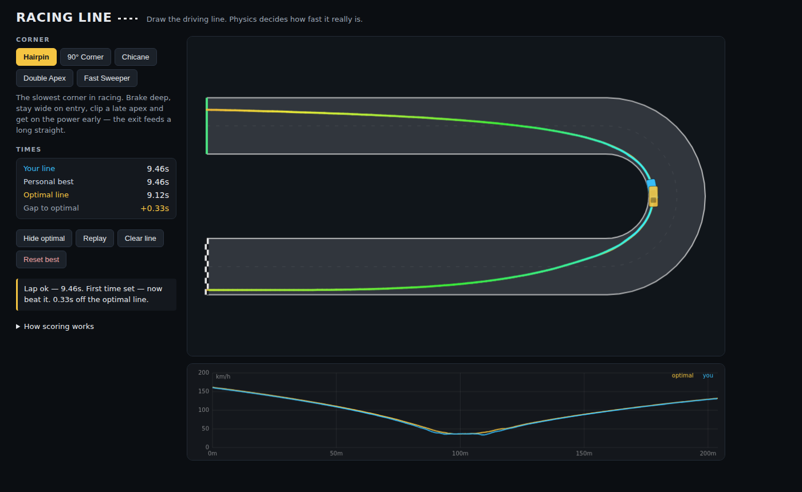

# Racing Line

Draw the driving line — physics decides how fast it really is.

A small browser game for learning racing lines. Pick a corner, draw the line
you think is fastest with your mouse or finger, and a lap-time simulation
tells you exactly how quick that line is. Iterate, compare against your ghost
and against a solver-computed optimal line, and discover the classic
principles for yourself: out wide, late apex, straighten the chicane.



## Running it

It's a static page with no dependencies and no build step. Serve the folder
with any static file server and open it:

```sh
python3 -m http.server 8080
# then open http://localhost:8080
```

(Any static host works, including GitHub Pages. Opening `index.html` via
`file://` won't work because the game uses ES modules.)

## How to play

- Pick a corner in the sidebar: Hairpin, 90°, Chicane, Double Apex or Fast Sweeper.
- Draw a line from the green entry gate to the chequered flag. Stay on the
  asphalt — off-track sections glow red and the attempt doesn't count.
- Your line is colored by simulated speed (blue = slow, red = fast) and a car
  replays it in real time. The telemetry strip below shows speed vs distance.
- Your personal best is saved per corner and replays as a ghost.
- **Show optimal** computes a near-optimal line for the corner with the same
  physics, so you can see how close you are — and steal its ideas.

## How the scoring works

The simulation is a quasi-steady-state speed-profile solver, the same method
used in real lap-time simulation tools:

1. The drawn line is smoothed and resampled every 0.5 m, and its curvature
   measured at each sample.
2. Cornering speed is capped by grip: `v = sqrt(a_lat / curvature)`, for a car
   with ~1.1 g of lateral grip and a 198 km/h top speed.
3. A forward pass applies traction- and power-limited acceleration; a backward
   pass applies braking limits. Both share grip with cornering through the
   friction circle, so the car can trail-brake but not brake at full force
   mid-corner.
4. Sector time is integrated along the line. Tight radii force low speeds —
   which is why the racing line trades a longer path for straighter, faster arcs.

The **optimal line** is found by optimising that exact sector time directly:
the candidate line is a smooth lateral-offset profile from the track
centerline, and a pattern search over the offsets minimises the simulated
time. Player lines and the optimal line are scored by the same code, so the
comparison is honest.

## Development

Physics, geometry and the solver are DOM-free ES modules shared between the
browser and Node. Run the sanity checks with:

```sh
node tests/sanity.mjs
```
